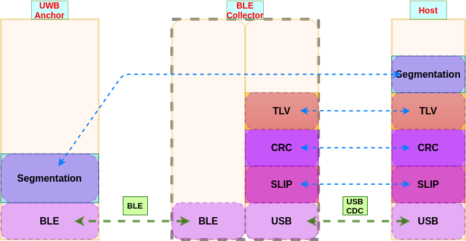
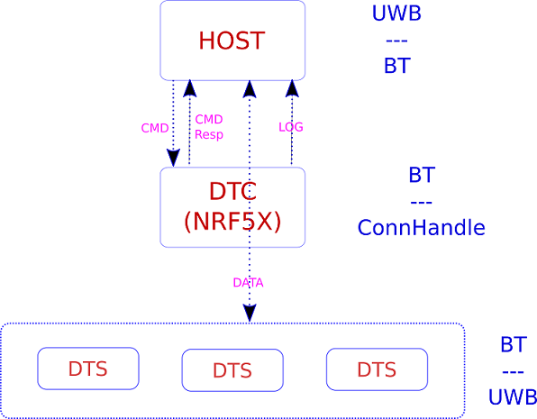

# BLE data Collector/Hub for BLE data_transfer service

In this project, we implement a BLE data collector/hub which plays as central(client) role and collects data from multiple peripheral(server) devices. Data is transmitted between `BLE Producer` and `BLE Collector` through customized BLE service `data_transfer_service`, besides, between `BLE Collector` and `Host` through USB.

The overall protocol for data transmission from `BLE Producer`(UWB Anchors) through `BLE Collecotr`(NRF52840 Dongle) to `Host`(PC) is shown as follows:

This project mainly deals with module `BLE Collector`, moreover, its data flow for Data/CMD/LOG channels is specified below:

## Requirements

- Hardware:
    - [x] NRF52840
    - [ ] NRF52832?
- Software:
    - IDE:
        - Segger Embedded Studio
    - SDK:
        - [x] Nordic NRF5 SDK v14.2
        - [x] Nordic NRF5 SDK v15.3
